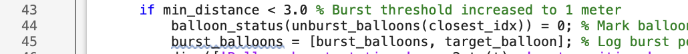

# Balloon-Bursting Drone Quadcopter  

## Problem Statement  
We need to burst 10 baloons that are randomly placed in a given space.

## Solution
We are gonna use a drone which will use PD controller to accurately reach to its target position. 

## Hardware Required
- **DJI A3 Autopilot**: an advanced flight controller designed to provide stability and precise control over the drone’s movements
- **Intel RealSense D435i Camera**: To detect distance from target
- **BasleracA2440-35ucCamera**: To take High resolution images
- **Onboard Computer**: To do all the calculations

## Control System
- **Kp**: Corrects position error
- **Kd**: Corrects velocity error

## MATLAB CODE 
- **Setting up our Simulation**
  
- **Setting up baloon radius**

- **Change Kp and Kd value**

## Output
- **Kp = 1.5 Kd = 1.5**

- **Kp = 2.5 Kd = 1.5**

## Presentation Video
[Click to see the video](https://drive.google.com/file/d/1-0Jk8IudvYfUo5HFqo5BQKWzc4U7pdU3/view?usp=share_link)

## Code
[Click to see MATLAB code](https://github.com/horrible-hacker/Control-of-Autonomous/blob/c5f69aaa8556d96754086bb7a80fe7c072cfd4e3/202201088_CAS_Project.m)
## Project Report
[Click to see project report](https://drive.google.com/file/d/1CVqxa5tb1B4_wgD7qeYDOUOv8TM0_Bec/view?usp=sharing)

## Github
[Click to open my Github profile](https://github.com/horrible-hacker/Control-of-Autonomous)

